---

## 👋 About Me

I'm a **Software Engineer** with 3+ years of experience building backend services, cloud-native workflows, and AI-powered applications across product and consulting environments. I develop FastAPI and Django services, REST and GraphQL interfaces, asynchronous AWS pipelines, and containerized deployments supporting scalable business workflows — and apply RAG, Anthropic Claude, LangChain, Pinecone, Speech-to-Text processing, and Responsible AI controls to deliver grounded conversational insights.

- 🏢 Currently at **Gong** - Software Engineer (Remote, USA)
- 🎓 M.S. Information Technology - Indiana Wesleyan University (2025)
- 📍 Based in IL, USA
- 🌐 Portfolio: [panthpatel16.github.io](https://panthpatel16.github.io)

---

## 🛠️ Tech Stack

**Programming & Software Engineering**

**Backend & APIs**

**Databases & Data Access**

**Applied AI & RAG**

**AWS & DevOps**

---

## 📊 Production Impact

| What I improved | Before → After | How |
|---|---|---|
| Grounded-answer precision | baseline → **↑ 18%** | RAG workflows with LangChain, Pinecone, and Anthropic Claude via AWS Bedrock (chunking, metadata filtering, reranking) |
| p95 insight-generation latency | baseline → **↓ 26%** | Async batching, caching, concurrency controls, and retry handling in ingestion/retrieval/summarization pipelines |
| Document-verification processing time | baseline → **↓ 32%** | Event-driven architecture with AWS Step Functions, SQS, and S3 |
| p95 API response time | baseline → **↓ 27%** | PostgreSQL query optimization, indexing, and Redis caching |
| Frontend integration issues | baseline → **↓ 20%** | Standardized JSON responses and validation across 12 REST endpoints |
| Staging response time | baseline → **↓ 22%** | Django ORM query optimization and PostgreSQL indexing |
| Historical market-data query latency | **~180ms → 40ms** | DynamoDB access-pattern design and time-series query optimization |

---

## 💼 Experience

**Software Engineer - Gong** *(Jul 2025 – Present | Remote, USA)*

- Developed Python and FastAPI services unifying call transcripts, emails, and CRM activity into account-level context — powering searchable summaries, coaching insights, deal-risk explanations, and recommended next actions
- Built RAG workflows using LangChain, Pinecone, and Anthropic Claude through AWS Bedrock model invocation APIs, improving grounded-answer precision by 18%
- Integrated Speech-to-Text processing for recorded customer conversations, extracting objections, competitor mentions, commitments, sentiment, and follow-up actions
- Engineered system prompts, few-shot examples, tool-calling schemas, and structured outputs, applying Responsible AI controls including guardrails, content filtering, PII masking, and citation validation
- Optimized asynchronous ingestion, embedding, retrieval, and summarization pipelines, reducing p95 insight-generation latency by 26%
- Expanded PyTest unit, integration, and LLM evaluation suites, integrating automated quality gates into CI/CD

**Python Developer - Simform** *(Jan 2023 – Jul 2024 | Gujarat, India)*

- Developed modular Python and FastAPI services for a multi-tenant customer-onboarding platform (registration, document submission, approval routing, notifications, workflow status)
- Designed REST and GraphQL interfaces across 18 endpoints and resolvers, standardizing Pydantic validation, authentication, and pagination
- Designed an event-driven document-verification and approval architecture using AWS Step Functions, SQS, and S3, reducing processing time by 32%
- Optimized PostgreSQL queries, indexes, and Redis caching, improving p95 API response time by 27%
- Containerized FastAPI services with Docker and deployed via Amazon ECS with health checks and centralized logging
- Expanded PyTest coverage and contributed to CI/CD quality gates preventing regression defects

**Software Developer Intern - TatvaSoft** *(Jun 2022 – Dec 2022 | Gujarat, India)*

- Built Python and Django backend modules for request creation, assignment, approval, status tracking, and audit-history workflows
- Developed and documented 12 REST API endpoints, reducing frontend integration issues by 20%
- Created PyTest unit and regression tests, reproducing and correcting defects reported during QA cycles
- Optimized Django ORM queries and PostgreSQL indexes, improving average staging response time by 22%

---

## 🚀 Featured Projects

### [StockPulse — Serverless Market Data Aggregator](https://github.com/panthpatel16/stockpulse)

> Serverless, event-driven application on AWS that processes real-time market data and computes financial indicators at low latency.

**Stack:** `Python` · `FastAPI` · `AWS Lambda` · `API Gateway` · `DynamoDB` · `EventBridge` · `AWS SAM`

- Developed and provisioned a serverless market-data platform using AWS SAM for automated cloud deployments
- Designed DynamoDB access patterns and optimized time-series queries, reducing p99 response latency from ~180ms to 40ms for historical market-data requests

### AI-Augmented CI/CD Pipeline

**Stack:** `Python` · `Flask` · `PyTest` · `Docker` · `GitHub Actions` · `CI/CD`

- Engineered a Python-based deployment pipeline that analyzed historical test and build metrics with rolling anomaly detection, blocking releases on quality or performance regressions
- Automated Docker health validation, retry handling, deployment tracking, and rollback to the last known-good image via GitHub Actions

---

## 📈 GitHub Stats

> These images are generated by a scheduled GitHub Action (see `.github/workflows/update-readme-stats.yml`) and committed straight into this repo — no external Vercel endpoint, so no more outages or rate limits.

---

## 🎓 Education & Certifications

**M.S. Information Technology** - Indiana Wesleyan University *(Aug 2024 – Dec 2025)*

**B.E. Information Technology** - Gujarat Technological University *(Aug 2019 – May 2023)*

**AWS Cloud Technical Essentials** - [Verify Certificate](https://www.coursera.org/account/accomplishments/verify/N9PGZEGDPUX6)

---

## 📫 Connect

